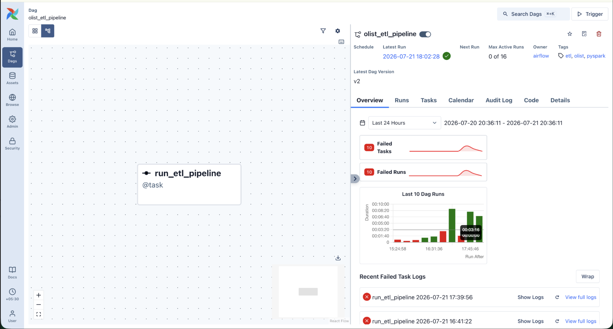
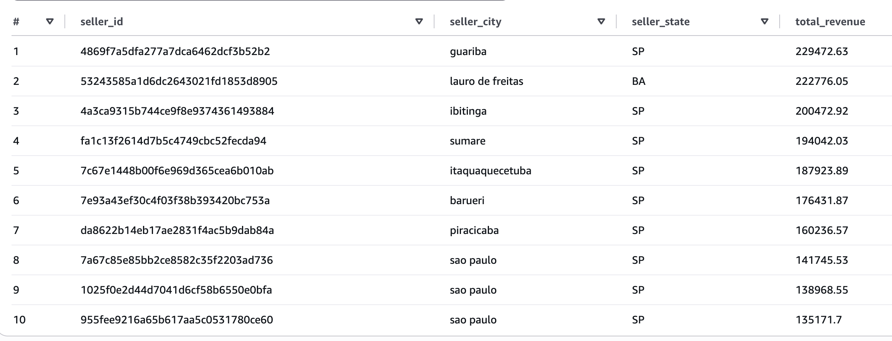
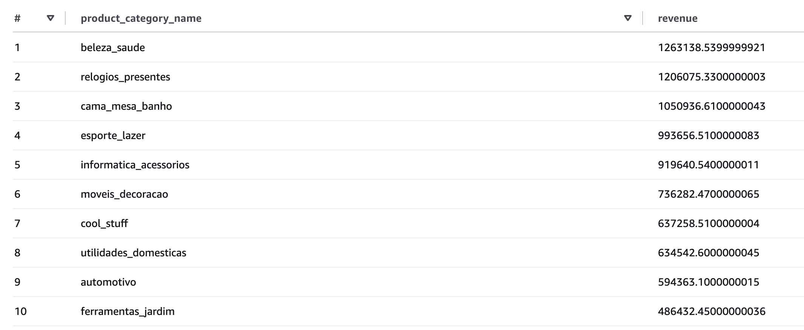
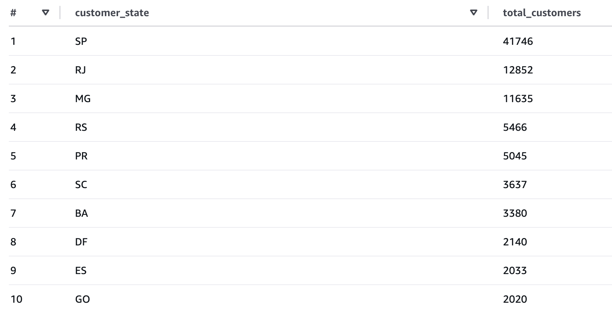

# Lakehouse Data Platform

A production-style end-to-end data engineering project built on AWS that ingests raw e-commerce data, processes it through a Medallion Architecture using PySpark and Delta Lake, orchestrates workflows with Apache Airflow, and exposes business-ready Gold tables through AWS Athena for analytics.

The platform demonstrates modern data engineering practices including scalable ETL pipelines, data quality validation, Delta Lake storage, workflow orchestration, and cloud-native analytics.

The project uses the Brazilian Olist E-commerce & AI Generated dataset to transform raw transactional data into curated analytical datasets for customer, seller, product, and payment insights.

---

## ✨ Key Features

- End-to-end ETL pipeline built with Apache Spark (PySpark)
- Medallion Architecture (Bronze → Silver → Gold)
- Delta Lake storage for ACID-compliant data lakes
- Workflow orchestration using Apache Airflow
- Cloud-native storage with Amazon S3
- AWS Athena integration for serverless SQL analytics
- AWS Glue Data Catalog for table registration
- Modular ETL design (Extract, Transform, Load)
- Automated data quality validation
- Configurable storage backends (Local or S3)
- Centralized logging and pipeline monitoring
- Business-ready Gold tables for analytics
- Production-ready project structure

---

## 🛠️ Tech Stack

| Category | Technology |
|-----------|------------|
| Programming Language | Python 3.13 |
| Data Processing | Apache Spark (PySpark) |
| Workflow Orchestration | Apache Airflow 3 |
| Storage Format | Delta Lake |
| Cloud Storage | Amazon S3 |
| Query Engine | Amazon Athena |
| Metadata Catalog | AWS Glue Data Catalog |
| Cloud Platform | AWS |
| Containerization | Docker |
| Data Format | CSV, Delta |
| Configuration | Python Config Module |
| Logging | Python Logging |
| Version Control | Git & GitHub |

---

## 🏗️ Architecture Overview

The platform implements a Medallion Architecture using Apache Spark and Delta Lake. Apache Airflow orchestrates the ETL workflow, processing raw CSV data through Bronze, Silver, and Gold layers stored in Amazon S3. Only the Gold layer is registered in the AWS Glue Data Catalog, allowing Amazon Athena to perform serverless SQL analytics. Business users and BI tools such as Power BI query the curated Gold tables to generate dashboards and analytical reports.


## ⚙️ Pipeline Workflow

The ETL pipeline follows a Medallion Architecture to progressively improve data quality and prepare datasets for analytics.

1. **Extract**
   - Read raw CSV datasets using PySpark.
   - Infer schemas and load distributed DataFrames.

2. **Bronze Layer**
   - Store raw data in Delta Lake format.
   - Preserve source data for traceability and reprocessing.

3. **Silver Layer**
   - Apply data quality validation.
   - Remove duplicates.
   - Handle missing values.
   - Standardize data types.
   - Perform business transformations.

4. **Gold Layer**
   - Generate business-ready summary tables:
     - `customer_summary`
     - `seller_summary`
     - `product_summary`
     - `payment_summary`

5. **Storage**
   - Persist all layers in Amazon S3 using Delta Lake.

6. **Catalog Registration**
   - Register Gold tables in the AWS Glue Data Catalog.

7. **Analytics**
   - Query Gold tables using Amazon Athena.
   - Connect BI tools such as Power BI to build dashboards and reports.

---

## 🌬️ Airflow Orchestration

The ETL pipeline is orchestrated using Apache Airflow.

A single TaskFlow task executes the complete ETL process, which includes:

- Extracting raw datasets
- Creating Bronze Delta tables
- Applying Silver transformations
- Generating Gold summary tables
- Registering Gold tables in AWS Glue for Athena

This design keeps the DAG simple while leveraging the modular ETL implementation inside the project.



---

## 🏅 Gold Layer Data Model

The Gold layer contains business-ready, denormalized summary tables optimized for analytical workloads. These tables are registered in the AWS Glue Data Catalog and queried through Amazon Athena.

| Table | Description | Primary Metrics | Business Use |
|--------|-------------|-----------------|--------------|
| **customer_summary** | Customer-level analytics | Total Orders, Total Spend, Average Order Value, First Purchase, Last Purchase | Customer segmentation, lifetime value analysis, retention analysis |
| **seller_summary** | Seller performance metrics | Revenue, Orders, Products Sold, Freight Cost, Average Product Price | Seller performance monitoring, marketplace analytics |
| **product_summary** | Product-level aggregated metrics | Revenue, Units Sold, Reviews, Average Price, Seller Count | Product performance, category analysis, inventory insights |
| **payment_summary** | Payment transaction summary | Payment Amount, Payment Type | Revenue analysis, payment method trends |

---

### customer_summary

Provides customer-centric KPIs for analyzing purchasing behavior and customer lifetime value.

**Example Metrics**
- Total Orders
- Total Spend
- Average Order Value
- First Purchase Date
- Last Purchase Date


### seller_summary

Aggregates seller performance across the marketplace.

**Example Metrics**
- Total Revenue
- Products Sold
- Freight Charges
- Average Product Price


### product_summary

Provides product and category level analytics.

**Example Metrics**
- Total Revenue
- Units Sold
- Average Review Score
- Number of Sellers
- Product Category


### payment_summary

Summarizes payment information for financial reporting.

**Example Metrics**
- Payment Amount
- Payment Method
- Revenue by Payment Type

---

### Why the Gold Layer?

Unlike Bronze and Silver tables, the Gold layer is specifically designed for business analytics.

These denormalized tables reduce query complexity and improve analytical performance by exposing curated datasets that can be directly consumed by:

- Amazon Athena
- Power BI
- Business Dashboards
- Ad-hoc SQL Analytics

Only the Gold tables are registered in the AWS Glue Data Catalog, ensuring that end users interact exclusively with trusted, business-ready datasets.

---

## 📊 Sample Analytics Queries

The Gold layer is optimized for analytical workloads and can be queried directly using Amazon Athena.

Below are some example business questions that can be answered using the curated Gold tables.

1. Revenue by Payment Method
```sql 
  SELECT
    payment_type,
    SUM(total_payment) AS revenue
FROM payment_summary
GROUP BY payment_type
ORDER BY revenue DESC;
```

| payment_type |    revenue |
| ------------ | ---------: |
| credit_card  | 12,345,678 |
| boleto       |  2,345,678 |
| voucher      |    987,654 |
| debit_card   |    456,789 |


2. Top 10 Sellers

```sql
SELECT
    seller_id,
    seller_city,
    seller_state,
    total_revenue
FROM seller_summary
ORDER BY total_revenue DESC
LIMIT 10;
```



3. Top Product Categories

```sql
SELECT
    product_category_name,
    SUM(total_revenue) AS revenue
FROM product_summary
GROUP BY product_category_name
ORDER BY revenue DESC;
```


4. Customer Distribution by State

```sql
SELECT
    customer_state,
    COUNT(*) AS total_customers
FROM customer_summary
GROUP BY customer_state
ORDER BY total_customers DESC;
```




## 🚀 Future Enhancements

- CI/CD pipeline using GitHub Actions
- Automated data quality monitoring
- Unit and integration testing
- Infrastructure provisioning with Terraform
- Power BI dashboard enhancements
- Streaming ingestion using Apache Kafka

---

## 📄 License

This project is licensed under the MIT License.